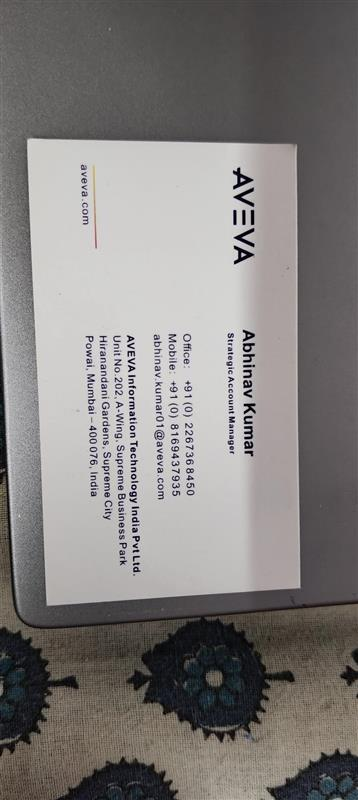

# Scanned Card Reader LLM

Lightweight toolkit for extracting structured information from scanned cards using OCR and LLM-based parsing.

## Overview

This repository contains a small Python project that demonstrates reading scanned card images (or structured card data), extracting fields, and mapping them into structured JSON using a combination of OCR-style input processing and language-model-guided parsing rules. It includes example configuration files for vendor/formats and minimal runner scripts.

## Repository Contents

- `app.py` — (Optional) Application entrypoint or web/app wrapper (if present).
- `app.py` — ASGI application entrypoint (runs the web/API server). Start with `uvicorn`.
- `main.py` — Secondary script to run the scanning/parsing pipeline (optional).
- `requirements.txt` — Python dependencies required to run the project.
- `pyproject.toml` — Project metadata and build config.
- `aspentech_details.json` — Example vendor/format details for AspenTech cards.
- `aveva_details.json` — Example vendor/format details for AVEVA cards.
- `LICENSE` — Project license.
- `README.md` — This file.

## Sample files

- `aveva.jpg` — Example scanned card image (input). Place this file in the repository root or provide its path when running the pipeline.
- `aveva_details.json` — Example parser output / response generated for `aveva.jpg` (structured JSON mapping of extracted fields).

## Example

Below is the example scanned card and the parser output generated for it.

### Input image



### Parsed JSON (example)

```json
{
	"extracted_info": {
		"name": [
			"Abhinav Kumar"
		],
		"email": [
			"abhinav.kumar01@aveva.com"
		],
		"phone": [
			"+91 (0) 2267368450",
			"+91 (0) 8169437335"
		],
		"designation": "Strategic Account Manager",
		"company_name": "AVEVA Information Technology India Pvt Ltd",
		"website": "aveva.com",
		"address": "Unit No 202 A-Wing, Supreme City, Hinudan Gardens, Supreme Business Park, Powai, Mumbai - 400076, India",
		"additional_info": {
			"category": []
		}
	}
}
```

## Requirements

- Python 3.8+
- See `requirements.txt` for exact package versions. Install with:

```bash
pip install -r requirements.txt
```

## Quick Start

1. Install dependencies (see above).
2. Prepare input data (images or text extracted from scanned cards) and place any vendor/config JSON files in the repository root.
3. Run the application or pipeline

- To run the web/API app (`app.py`) with `uvicorn` on port `5001`:

```bash
uvicorn app:app --host 0.0.0.0 --port 5001
```

Add `--reload` during development to auto-reload on changes:

```bash
uvicorn app:app --host 0.0.0.0 --port 5001 --reload
```

- To run the standalone pipeline script (if used):

```bash
python main.py
```

## Configuration

The JSON files (`aspentech_details.json`, `aveva_details.json`) are provided as example configuration and mapping templates for specific card formats. Adapt or extend these files to support additional vendors or custom card fields.

## Development Notes

- The project is intentionally minimal. Typical extensions include integrating an OCR engine (Tesseract, commercial OCR), adding image preprocessing, and wiring an LLM (OpenAI, local LLM) to convert free-form OCR output into structured JSON via prompt templates.
- Reuse or centralize configuration for production use and add tests for parsing rules.

## License

This project includes a `LICENSE` file. Review it for license terms.

---

If you want, I can run a quick lint or validate `main.py` next. Tell me which you'd prefer.

